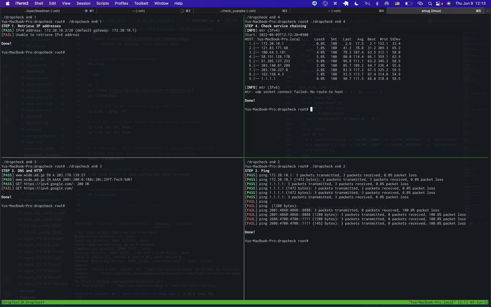

# dropcheck

For Interop Tokyo 2022

Based on [sirafantas/dropcheck](https://github.com/sirafantas/dropcheck)


## Requirements

- macOS
- iproute2mac
- wget
- screen
- mtr
- (new!) [smug](https://github.com/ivaaaan/smug)
    - Install by running `brew install smug`


## Usage

```sh

cd ~/
git clone https://github.com/yuasabe/dropcheck.git
cd ~/dropcheck

# Check the target interface (e.g. en0, vlan1)
ip link | grep 'UP'

# Turn off interfaces except for the target interface
ip link set en1 down
ip link set en2 down
...

# If necessary, edit root directory of smug_config.yml file
# Change the line below to point to your directory:
root: ~/dropcheck

# Run tests (remember to specify interface)
sudo smug start -f smug_config.yml interface=en0

# When finished, exit tmux
Ctrl-B, :kill-window
```

## Screenshots


